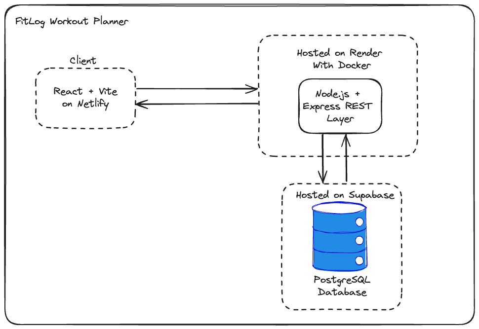
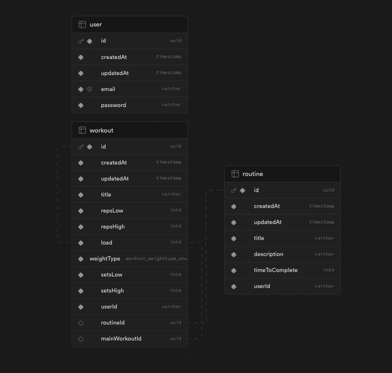

# FitLog

## Introduction

Welcome to the Workout Planner Application! This is a powerful tool designed to help you organize and track your fitness journey. Whether you're a seasoned athlete or just getting started on your fitness goals, this PERN (PostgreSQL, Express, React, Node.js) stack application provides an intuitive and efficient way to plan, record, and analyze your workouts. With features like customizable workout routines, progress tracking, and social sharing, achieving your fitness objectives has never been easier. This README serves as your comprehensive guide to getting started with our application, including installation instructions, usage guidelines, and additional resources to make the most out of your fitness journey. Let's embark on this journey together towards a healthier and fitter you! 💪🏋️‍♂️🏋️‍♀️

## Feature Set

Our workout planner application currently offers the following core features:

### Account Creation and Login

-   **User Registration**: New users can create accounts by providing essential information such as username, email, and password.

-   **Secure Authentication**: User authentication is implemented to ensure the security of user accounts. Passwords are securely hashed and stored.

-   **User Login**: Registered users can log in to their accounts using their credentials, gaining access to personalized workout planning features.

### Exercise Routine Management

-   **Create Routines**: Users have the ability to create custom workout routines. They can define workout names, load, number of reps.

-   **Add and Read Workouts in Your Routine**: Users can view their created workouts, including exercise details, to review and follow their fitness plans.

-   **Update Routines and Workouts**: Modify and adjust existing workouts as fitness goals evolve. Edit workout names, descriptions, and exercise lists.

-   **Delete Routines and Workouts**: Users can remove workouts that are no longer relevant or needed.

These features provide users with the foundation for planning and managing their fitness routines within our workout planner application. We are continuously working to enhance and expand our feature set to better serve our users' fitness needs. See the future of FitLog at the roadmap section of our readme!

## Usage:

### Live Access

Access the application, live on Netlify https://fitlog-workout-planner.netlify.app

### Locally

To run this application locally download the src code and follow instructions for the next two sections.

#### Frontend

Navigate to the frontend-vite folder, in your terminal run `npm install` then run `npm run dev`. The frontend will now be running locally on port 5173

#### Backend

Navigate to the backend folder, in your terminal run `npm install`. Run npm run dev, you will need to populate the .env folder with your own local mongodb credentials.

## Architecture

## Database Diagram

## Technologies Used:

The choice of the MERN stack for our workout planner application was driven by a combination of flexibility, scalability, and developer-friendliness. MongoDB, a NoSQL database, provides the agility required to store complex fitness data, allowing us to adapt and expand our data model as our application evolves. Express, a minimal and robust Node.js web application framework, allows for efficient routing and handling of HTTP requests. React, with its component-based architecture, offers a dynamic and responsive user interface that aligns seamlessly with the needs of fitness enthusiasts who require real-time updates and interactivity. Node.js, as the runtime environment, enables server-side JavaScript execution, ensuring a consistent language throughout the stack. Together, the MERN stack empowers us to deliver a modern, performant, and feature-rich workout planner that's ready to meet the demands of both novice and experienced users in their fitness journeys.

## Deployement:

Our workout planner application is seamlessly deployed to ensure accessibility and reliability. The frontend is hosted on Netlify, providing a fast and user-friendly web experience. Netlify's continuous integration and deployment (CI/CD) pipelines ensure that the latest changes are automatically deployed to production, reducing development overhead.

For the backend, we've taken a containerized approach. The Node.js server and Express application are packaged into a Docker container , allowing for consistent and efficient deployment across different environments. The container is deployed to Render, a platform designed for easy and scalable container hosting. Render's simplicity and automatic scaling make it an ideal choice for ensuring our backend remains responsive and available, even during periods of high traffic.

The PostgreSQL database is deployed using Supabase, a platform that provides a managed PostgreSQL database with a built-in API. Supabase's simple and intuitive interface allows us to easily manage our database, including the ability to create tables, add data, and query the database.

With this deployment setup, we prioritize performance, scalability, and reliability to provide our users with a seamless workout planning experience

## Roadmap

### Testing (Unit and Integration)

-   Strengthen application reliability by incorporating comprehensive testing.
    -   **Unit Testing with Jest**: Implement unit tests to verify individual components, functions, and modules, ensuring their correctness and robustness.
    -   **Integration Testing with Jest and Supertest**: Perform integration tests to validate the interactions between different parts of the application, checking for proper functionality.
    -   **UI Testing with React Testing Library**: Conduct UI testing to ensure that user interfaces meet design expectations and that user interactions work as intended.

### Enhance User Profile Management

-   Implement a comprehensive UI and backend functionality for users to update their profiles, change passwords, manage email addresses, and add avatars using S3 buckets.

### Improve Session Management

-   Transition from local storage to cookies for session information storage, and consider implementing Redis sessions for enhanced security and efficiency.

### Mobile Application Development

-   Explore the development of a mobile UI using technologies such as React Native or Swift to extend the reach of our workout planner application.

### Implement Caching

-   Introduce a Redis caching layer for optimized data retrieval from the workouts database, including exercises and routines.

### Enhance User Authentication

-   Integrate Single Sign-On (SSO) capabilities and implement a "forgot password" feature, leveraging services like Sendgrid API or other email services for enhanced user security.

### Improve Search Functionality

-   Add a robust search bar to the frontend, enabling users to easily find exercises and routines, enhancing overall usability.

### Microservices Architecture

-   Transition to a microservices architecture, including the creation of an API gateway in Golang. Implement Kubernetes (k8s) for efficient service management within a cluster.

### Database Migration

  -   ~~Migrate from MongoDB to PostgreSQL, utilizing TypeORM for improved data management and scalability.~~

### Introduce Routines

-   ~~Enable users to create and share workout routines, including a "likes" attribute for public consumption. This feature can be used to create personalized feeds for users.~~

### Social Media Integration

-   Explore the addition of social media and networking features within the application, tailoring the complexity and depth of these enhancements as needed.

### Communication Features

-   Integrate real-time communication capabilities, including chat and video calling using sockets, to facilitate interaction among users.

### AI Integration

-   Consider integrating ChatGPT APIs for personalized workout routine suggestions and prompts based on user data.

### Local Development Support

-   Simplify local development with Docker Compose, providing a local version of the MongoDB database for user convenience during development.

### API Documentation

-   Enhance developer experience by adding Swagger documentation for our APIs, ensuring clarity and ease of integration for external developers.

## Contributing

Pull requests are welcome. For major changes, please open an issue first to discuss what you would like to change.
